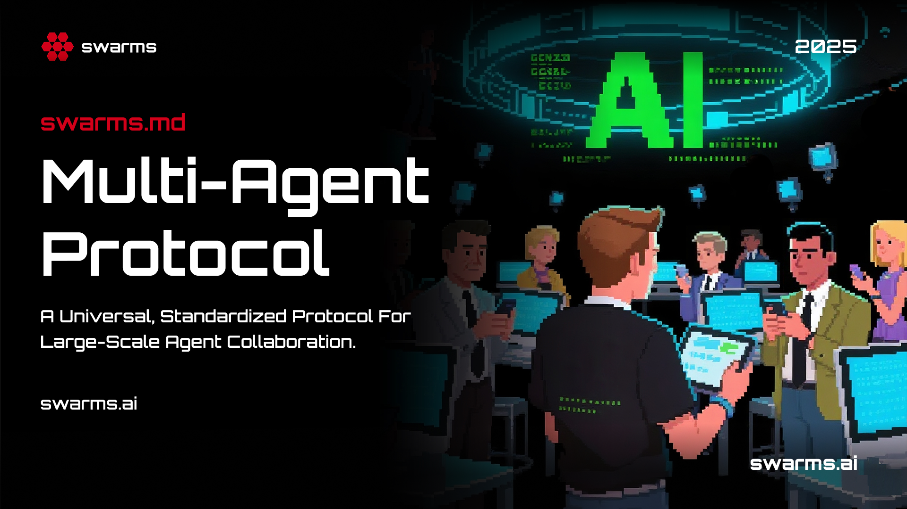

# The `swarms.md` Protocol: Universal Protocol for Large-Scale Multi-Agent Collaboration



The Swarms Protocol represents a breakthrough in multi-agent system design, providing a universal, standardized approach to large-scale agent collaboration. This protocol establishes a common language and framework that enables seamless coordination between diverse agents, regardless of their underlying implementation or domain specialization.

## What is the Swarms Protocol?

The Swarms Protocol is a comprehensive, open-source standard for orchestrating complex multi-agent workflows. It provides a declarative YAML-based configuration system that allows developers, researchers, and organizations to define sophisticated agent architectures without writing extensive code. This protocol serves as the foundation for building scalable, interoperable agent systems that can tackle complex, multi-faceted problems.

## Why the Swarms Protocol Matters

In today's agent landscape, individual agents excel at specific tasks but struggle with complex, multi-dimensional problems that require collaboration. The Swarms Protocol addresses this fundamental limitation by providing:

- **Universal Interoperability**: Standardized communication and coordination between agents
- **Scalable Architecture**: Support for hundreds to thousands of collaborating agents
- **Domain Agnostic**: Applicable across any industry or use case
- **Open Standards**: Vendor-neutral, community-driven development
- **Rapid Deployment**: Declarative configuration reduces development time from weeks to hours

## How the Swarms Protocol Works

The Swarms Protocol operates on three fundamental principles that enable large-scale multi-agent collaboration:

### 1. Declarative Configuration
Instead of imperative programming, the protocol uses declarative YAML configurations that describe *what* should happen rather than *how* it should happen. This approach enables:
- **Rapid Prototyping**: Define complex workflows in minutes, not days
- **Easy Modification**: Change agent behavior without rewriting code
- **Version Control**: Track configuration changes alongside code
- **Team Collaboration**: Non-programmers can understand and modify workflows

### 2. Universal Agent Interface
Every agent in the Swarms Protocol follows a standardized interface, ensuring:
- **Seamless Integration**: Mix and match agents from different sources
- **Consistent Behavior**: Predictable interaction patterns
- **Easy Testing**: Standardized testing and validation procedures
- **Scalable Deployment**: Add or remove agents without system changes

### 3. Intelligent Orchestration
The protocol automatically handles the complex coordination logic:
- **Dynamic Routing**: Automatically route tasks to appropriate agents
- **Load Balancing**: Distribute work across available agents
- **Fault Tolerance**: Handle agent failures gracefully
- **Resource Optimization**: Efficiently utilize computational resources

## Protocol Capabilities

The Swarms Protocol supports:
- **Single Agent Creation**: Define individual agents with custom parameters
- **Multi-Agent Swarms**: Create various swarm architectures
- **Flexible Return Types**: Control what gets returned from the configuration
- **Custom Parameters**: Pass through any additional parameters to agents and swarms
- **Error Handling**: Built-in retry logic and validation
- **Real-time Monitoring**: Dashboard and logging for system oversight
- **State Persistence**: Save and restore agent states across sessions

## Basic YAML Structure

```yaml
agents:
  - agent_name: "Agent1"
    system_prompt: "You are a helpful assistant"
    model_name: "gpt-4o"
    max_loops: 1
    # ... other agent parameters

swarm_architecture:
  name: "MySwarm"
  description: "A multi-agent workflow"
  swarm_type: "SequentialWorkflow"
  task: "Complete the assigned task"
  # ... other swarm parameters
```

## Agent Configuration

### Required Fields

- `agent_name`: Unique identifier for the agent
- `system_prompt`: The agent's role and behavior definition

### Optional Fields

- `model_name`: LLM model to use (defaults to auto-selection)
- `max_loops`: Maximum execution loops (default: 1)
- `autosave`: Enable state persistence (default: true)
- `dashboard`: Enable dashboard (default: false)
- `verbose`: Enable verbose logging (default: false)
- `dynamic_temperature_enabled`: Enable dynamic temperature (default: false)
- `saved_state_path`: Path for saving agent state
- `user_name`: User identifier (default: "default_user")
- `retry_attempts`: Number of retry attempts (default: 3)
- `context_length`: Maximum context length (default: 100000)
- `return_step_meta`: Return step metadata (default: false)
- `output_type`: Output format (default: "str")
- `auto_generate_prompt`: Auto-generate prompts (default: false)
- `artifacts_on`: Enable artifacts (default: false)
- `artifacts_file_extension`: Artifact file extension (default: ".md")
- `artifacts_output_path`: Artifact output directory

### Custom Parameters

You can add any additional parameters that will be passed through to the Agent constructor:

```yaml
agents:
  - agent_name: "CustomAgent"
    system_prompt: "You are a specialized agent"
    custom_param1: "value1"
    custom_param2: 42
    nested_config:
      key: "value"
```

## Swarm Architecture Configuration

### Required Fields

- `name`: Unique identifier for the swarm
- `description`: Description of the swarm's purpose
- `swarm_type`: Type of swarm architecture

### Supported Swarm Types

1. **SequentialWorkflow**: Agents execute tasks in sequence
2. **ConcurrentWorkflow**: Agents execute tasks simultaneously
3. **AgentRearrange**: Dynamic agent reordering based on task requirements
4. **MixtureOfAgents**: Multiple agents contribute to a single solution
5. **auto**: Automatic swarm type selection

### Optional Fields

- `max_loops`: Maximum execution loops (default: 1)
- `task`: Task description for the swarm
- `flow`: Workflow definition
- `autosave`: Enable state persistence (default: true)
- `return_json`: Return JSON output (default: false)
- `rules`: Swarm execution rules

## Multi-Agent Architecture Examples

The Swarms Protocol supports five core architectural patterns that can be combined and extended to create sophisticated multi-agent systems. These patterns represent proven approaches to complex problem-solving that have been validated across numerous domains.

### 1. Sequential Workflow

A sequential workflow executes agents in order, where each agent builds upon the previous agent's output. This pattern is ideal for problems that require step-by-step analysis or where each step depends on the previous one.

```yaml
agents:
  - agent_name: "Market-Researcher"
    system_prompt: |
      You are a market research specialist. Your tasks include:
      1. Analyzing market trends and patterns
      2. Identifying market opportunities and threats
      3. Evaluating competitor strategies
      4. Assessing customer needs and preferences
      5. Providing actionable market insights
    model_name: "claude-3-sonnet-20240229"
    max_loops: 1
    temperature: 0.7
    streaming_on: true

  - agent_name: "Financial-Analyst"
    system_prompt: |
      You are a financial analysis expert. Your responsibilities include:
      1. Analyzing financial statements
      2. Evaluating investment opportunities
      3. Assessing risk factors
      4. Providing financial forecasts
      5. Recommending financial strategies
    model_name: "claude-3-sonnet-20240229"
    max_loops: 1
    streaming_on: true
    temperature: 0.7

  - agent_name: "Technical-Analyst"
    system_prompt: |
      You are a technical analysis specialist. Your focus areas include:
      1. Analyzing price patterns and trends
      2. Evaluating technical indicators
      3. Identifying support and resistance levels
      4. Assessing market momentum
      5. Providing trading recommendations
    model_name: "claude-3-sonnet-20240229"
    max_loops: 1
    streaming_on: true
    temperature: 0.7

swarm_architecture:
  name: "market-analysis-router"
  description: "Sequential market analysis workflow"
  swarm_type: "SequentialWorkflow"
  max_loops: 1
  task: "Analyze Tesla (TSLA) stock from market, financial, and technical perspectives"
```

**Use Case**: Market analysis, research workflows, step-by-step problem solving, scientific research pipelines, legal document review

### 2. Concurrent Workflow

A concurrent workflow executes multiple agents simultaneously, useful for independent tasks that can run in parallel. This pattern maximizes efficiency by leveraging parallel processing capabilities.

```yaml
agents:
  - agent_name: "Delaware-CCorp-Hiring-Agent"
    system_prompt: |
      Create a comprehensive hiring description for a Delaware C Corporation, 
      including all relevant laws and regulations, such as the Delaware General 
      Corporation Law (DGCL) and the Delaware Corporate Law. Ensure the description 
      covers the requirements for hiring employees, contractors, and officers, 
      including the necessary paperwork, tax obligations, and benefits.
    model_name: "gpt-4o"
    max_loops: 1

  - agent_name: "Indian-Foreign-Hiring-Agent"
    system_prompt: |
      Create a comprehensive hiring description for an Indian or foreign country, 
      including all relevant laws and regulations, such as the Indian Contract Act, 
      the Indian Labour Laws, and the Foreign Exchange Management Act (FEMA). 
      Ensure the description covers the requirements for hiring employees, 
      contractors, and officers, including the necessary paperwork, tax obligations, 
      and benefits.
    model_name: "gpt-4o"
    max_loops: 1

swarm_architecture:
  name: "hiring-compliance-swarm"
  description: "Concurrent hiring compliance analysis"
  swarm_type: "ConcurrentWorkflow"
  max_loops: 1
  task: "what is the best state to incorporate a company in the USA?"
  return_str_on: false
  output_type: "list"
```

**Use Case**: Parallel research, independent analysis, comparative studies, compliance audits, multi-jurisdictional legal analysis

### 3. Hierarchical Swarm

A hierarchical swarm uses a director agent to coordinate and delegate tasks to specialized worker agents. This pattern provides centralized oversight while maintaining specialized expertise, making it ideal for complex projects requiring coordination and quality control.

```yaml
agents:
  - agent_name: "Stock-Analysis-Agent"
    system_prompt: |
      As the Stock Analysis Agent, your primary responsibilities include:
      1. Market Trend Analysis: Evaluate current and historical market data 
         to identify trends, patterns, and potential investment opportunities.
      2. Risk & Opportunity Assessment: Pinpoint specific factors that can 
         guide informed investment decisions.
      3. Reporting & Recommendations: Present findings in a structured, 
         easy-to-understand format, offering actionable insights.
    model_name: "gpt-4o"
    max_loops: 1
    interactive: false
    streaming_on: false

swarm_architecture:
  name: "hierarchical-stock-analysis"
  description: "Hierarchical swarm with director coordination"
  swarm_type: "HierarchicalSwarm"
  max_loops: 3
  task: "Analyze the current market conditions and provide investment recommendations"
  director_model: "gpt-4o"
  director_system_prompt: |
    As the Director of this Hierarchical Agent Swarm, you are in charge of 
    coordinating and overseeing all tasks, ensuring that each is executed 
    efficiently and effectively by the appropriate agents.
```

**Use Case**: Complex project management, research coordination, quality assurance workflows, enterprise architecture planning, regulatory compliance management

### 4. Mixture of Agents

A mixture of agents approach combines multiple agents' outputs to create a comprehensive solution. This pattern leverages the collective intelligence of multiple specialized agents to provide holistic analysis and recommendations.

```yaml
agents:
  - agent_name: "Risk-Metrics-Calculator"
    agent_description: "Calculates key risk metrics like VaR, Sharpe ratio, and volatility"
    system_prompt: |
      You are a risk metrics specialist. Calculate and explain:
      - Value at Risk (VaR)
      - Sharpe ratio
      - Volatility
      - Maximum drawdown
      - Beta coefficient
      Provide clear, numerical results with brief explanations.
    max_loops: 1
    random_model_enabled: true
    dynamic_temperature_enabled: true
    output_type: "str-all-except-first"
    max_tokens: 4096

  - agent_name: "Portfolio-Risk-Agent"
    agent_description: "Analyzes portfolio diversification and concentration risk"
    system_prompt: |
      You are a portfolio risk analyst. Focus on:
      - Portfolio diversification analysis
      - Concentration risk assessment
      - Correlation analysis
      - Sector/asset allocation risk
      - Liquidity risk evaluation
      Provide actionable insights for risk reduction.
    max_loops: 1
    random_model_enabled: true
    dynamic_temperature_enabled: true
    output_type: "str-all-except-first"
    max_tokens: 4096

  - agent_name: "Market-Risk-Monitor"
    agent_description: "Monitors market conditions and identifies risk factors"
    system_prompt: |
      You are a market risk monitor. Identify and assess:
      - Market volatility trends
      - Economic risk factors
      - Geopolitical risks
      - Interest rate risks
      - Currency risks
      Provide current risk alerts and trends.
    max_loops: 1
    random_model_enabled: true
    dynamic_temperature_enabled: true
    output_type: "str-all-except-first"
    max_tokens: 4096

swarm_architecture:
  name: "risk-analysis-swarm"
  description: "Comprehensive risk analysis using multiple specialized agents"
  swarm_type: "MixtureOfAgents"
  max_loops: 1
  task: "Calculate VaR and Sharpe ratio for a portfolio with 15% annual return and 20% volatility"
  layers: 1
  output_type: "final"
```

**Use Case**: Comprehensive analysis, multi-perspective evaluation, risk assessment, investment portfolio analysis, enterprise risk management

### 5. Council of Judges

A council of judges pattern uses multiple agents to evaluate and vote on solutions. This pattern ensures robust decision-making by incorporating multiple expert perspectives and implementing democratic evaluation processes.

```yaml
agents:
  - agent_name: "Technical-Judge"
    system_prompt: |
      You are a technical expert judge. Evaluate solutions based on:
      - Technical feasibility
      - Implementation complexity
      - Performance characteristics
      - Scalability considerations
      - Technical best practices
      Rate solutions from 1-10 and provide detailed feedback.
    model_name: "gpt-4o"
    max_loops: 1

  - agent_name: "Business-Judge"
    system_prompt: |
      You are a business strategy judge. Evaluate solutions based on:
      - Business value and ROI
      - Market fit and demand
      - Competitive advantage
      - Resource requirements
      - Strategic alignment
      Rate solutions from 1-10 and provide detailed feedback.
    model_name: "gpt-4o"
    max_loops: 1

  - agent_name: "User-Experience-Judge"
    system_prompt: |
      You are a user experience judge. Evaluate solutions based on:
      - User interface design
      - User journey optimization
      - Accessibility considerations
      - User satisfaction metrics
      - Usability testing results
      Rate solutions from 1-10 and provide detailed feedback.
    model_name: "gpt-4o"
    max_loops: 1

swarm_architecture:
  name: "solution-evaluation-council"
  description: "Multi-perspective solution evaluation using expert judges"
  swarm_type: "CouncilOfJudges"
  max_loops: 2
  task: "Evaluate the proposed AI-powered customer service solution"
  voting_mechanism: "majority"
  consensus_threshold: 0.7
```

**Use Case**: Solution evaluation, quality assessment, decision-making processes, product development reviews, strategic planning validation

## Advanced Configuration Features

### Custom Swarm Parameters

You can pass custom parameters to swarm architectures:

```yaml
swarm_architecture:
  name: "custom-swarm"
  description: "Swarm with custom parameters"
  swarm_type: "SequentialWorkflow"
  custom_param1: "value1"
  custom_param2: 42
  nested_config:
    key: "value"
```

### Dynamic Task Assignment

```yaml
swarm_architecture:
  name: "dynamic-swarm"
  description: "Swarm with dynamic task assignment"
  swarm_type: "AgentRearrange"
  max_loops: 3
  task: "Analyze the provided dataset and generate insights"
  flow:
    initial_agents: ["researcher", "analyst"]
    max_agents: 5
    selection_criteria: "expertise_match"
```

### Error Handling and Retry Logic

The system includes built-in retry logic for transient failures:

```yaml
agents:
  - agent_name: "ResilientAgent"
    system_prompt: "You are a resilient agent that handles failures gracefully"
    retry_attempts: 5
    max_loops: 3
    # Custom retry configuration
    retry_on_exceptions: ["ConnectionError", "TimeoutError"]
    retry_delay: 2
    exponential_backoff: true
```

## Execution and Return Types

### Return Type Options

- `"auto"`: Automatically determine return type based on configuration
- `"swarm"`: Return the swarm router
- `"agents"`: Return the list of created agents
- `"both"`: Return tuple of (swarm_router, agents)
- `"tasks"`: Return task execution results
- `"run_swarm"`: Execute the swarm and return results

### Example Usage

```python
from swarms.agents.create_agents_from_yaml import create_agents_from_yaml

# Create and execute swarm
result = create_agents_from_yaml(
    yaml_file="my_swarm.yaml",
    return_type="run_swarm"
)

# Create swarm without execution
swarm, agents = create_agents_from_yaml(
    yaml_file="my_swarm.yaml",
    return_type="both"
)

# Create only agents
agents = create_agents_from_yaml(
    yaml_file="my_swarm.yaml",
    return_type="agents"
)
```

## Why Adopt the Swarms Protocol?

The Swarms Protocol represents a paradigm shift in how organizations approach agent implementation. Here's why forward-thinking organizations are adopting this protocol:

### **1. Exponential Productivity Gains**
- **10x Faster Development**: Reduce multi-agent system development from months to days
- **Rapid Iteration**: Modify agent behavior and workflows in real-time
- **Reduced Maintenance**: Declarative configurations are easier to maintain and debug

### **2. Enterprise-Grade Scalability**
- **Horizontal Scaling**: Add hundreds of agents without architectural changes
- **Vertical Scaling**: Handle complex, multi-dimensional problems
- **Load Distribution**: Automatically balance workloads across agent pools

### **3. Cost Optimization**
- **Resource Efficiency**: Optimize computational resource utilization
- **Model Selection**: Choose the right model for each specific task
- **Reduced Redundancy**: Eliminate duplicate agent implementations

### **4. Risk Mitigation**
- **Fault Tolerance**: Built-in error handling and retry mechanisms
- **Quality Assurance**: Multi-agent validation and consensus building
- **Compliance**: Standardized workflows for regulatory requirements

### **5. Competitive Advantage**
- **First-Mover Benefits**: Early adopters gain significant competitive advantages
- **Innovation Acceleration**: Rapid prototyping of new agent capabilities
- **Talent Attraction**: Developers prefer working with modern, standardized systems

## Best Practices

### 1. Agent Design

- **Clear System Prompts**: Write specific, actionable system prompts
- **Role Specialization**: Each agent should have a distinct, focused role
- **Parameter Optimization**: Tune parameters like temperature and max_loops for your use case
- **Error Handling**: Include retry logic and fallback mechanisms

### 2. Swarm Architecture Selection

- **SequentialWorkflow**: Use for dependent, step-by-step processes
- **ConcurrentWorkflow**: Use for independent, parallel tasks
- **HierarchicalSwarm**: Use for complex coordination and quality control
- **MixtureOfAgents**: Use for comprehensive, multi-perspective analysis
- **AgentRearrange**: Use for dynamic, adaptive workflows

### 3. Configuration Management

- **Modular Design**: Break complex swarms into smaller, reusable components
- **Environment Variables**: Use environment variables for sensitive configuration
- **Validation**: Always validate your YAML configuration before deployment
- **Documentation**: Document the purpose and expected behavior of each agent

### 4. Performance Optimization

- **Model Selection**: Choose appropriate models for each agent's role
- **Context Management**: Optimize context length and token usage
- **Caching**: Enable autosave for state persistence
- **Monitoring**: Use verbose logging and dashboard features for debugging

## Troubleshooting

### Common Issues

1. **YAML Parsing Errors**: Check YAML syntax and indentation
2. **Missing Required Fields**: Ensure all required fields are present
3. **Invalid Swarm Types**: Verify swarm_type values are supported
4. **Model Availability**: Confirm specified models are accessible
5. **Memory Issues**: Adjust context_length and max_tokens appropriately

### Debugging Tips

- Enable verbose logging with `verbose: true`
- Use the dashboard feature for real-time monitoring
- Check agent state with `autosave: true`
- Validate configuration with Pydantic models
- Review error logs for specific failure reasons

## Conclusion

The Swarms Protocol represents the future of large-scale agent collaboration. By providing a universal, standardized approach to multi-agent orchestration, it enables organizations to build sophisticated agent systems that were previously impossible or prohibitively expensive to develop.

### **The Protocol Advantage**

The Swarms Protocol is a fundamental paradigm shift in how we think about agent collaboration. By abstracting away the complexity of agent coordination and providing declarative configuration, it democratizes access to advanced agent capabilities while maintaining enterprise-grade reliability and scalability.

### **Getting Started**

1. **Start Simple**: Begin with a single agent and gradually add complexity
2. **Experiment**: Try different swarm architectures to find what works for your use case
3. **Scale Gradually**: Add agents incrementally as you understand the system
4. **Join the Community**: Contribute to the open-source ecosystem and learn from others

### **The Future is Collaborative**

As agent continues to evolve, the ability to coordinate multiple specialized agents will become increasingly critical. The Swarms Protocol positions you at the forefront of this evolution, providing the tools and frameworks needed to build the next generation of agent systems.

The protocol provides a vision for how agent systems should work together. By adopting the Swarms Protocol, you're joining a movement toward more intelligent, collaborative, and scalable agent systems.

For more examples and advanced use cases, explore the examples directory in the Swarms repository, which contains implementations of various multi-agent patterns and architectures. Join the community and help shape the future of multi-agent collaboration.
